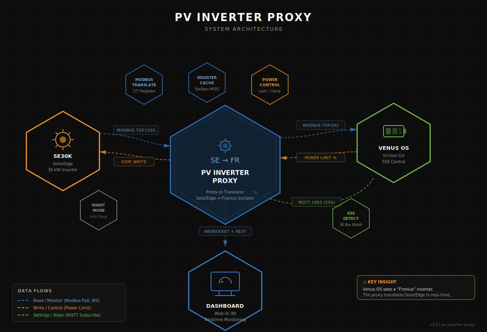

# PV-Inverter-Master

Multi-inverter aggregator that combines **SolarEdge**, **OpenDTU** (Hoymiles), and **Shelly** devices into a single **Fronius-compatible SunSpec endpoint** for **Venus OS** (Victron). Venus OS natively discovers, monitors, and controls all inverters as one — including power limiting via DVCC/ESS.

Includes a dark-themed **web dashboard** with live monitoring, per-device management, power control, and Venus OS integration.

## Prerequisites

- **Debian 12+** / **Ubuntu 22.04+** (LXC, VM, or bare metal)
- **Python 3.12+** (installed automatically by installer)
- **Venus OS >= 3.7** (required for MQTT on LAN feature)
- All devices on the same LAN

## Installation

```bash
curl -fsSL https://raw.githubusercontent.com/meintechblog/pv-inverter-master/main/install.sh | bash
```

This installs everything: Python venv, systemd service, default config. Edit the config afterwards:

```bash
nano /etc/pv-inverter-proxy/config.yaml
systemctl restart pv-inverter-proxy
```

### Update

Same command — the script detects an existing installation and updates in-place:

```bash
curl -fsSL https://raw.githubusercontent.com/meintechblog/pv-inverter-master/main/install.sh | bash
```

## Supported Devices

| Device Type | Connection | Capabilities |
|-------------|-----------|--------------|
| **SolarEdge** | Modbus TCP | Full: polling, power limiting, 3-phase AC + DC |
| **OpenDTU** (Hoymiles) | REST API | Full: polling, power limiting, DC channels |
| **Shelly** (Gen1/Gen2/Gen3) | HTTP REST | Polling, relay on/off, mDNS discovery |

All devices are aggregated into a single virtual Fronius inverter that Venus OS sees and controls.

## Features

- **Multi-Inverter Aggregation** — SolarEdge + OpenDTU + Shelly combined into one SunSpec endpoint
- **Virtual Fronius Inverter** — Venus OS auto-detects as "Fronius" with aggregated power from all devices
- **Per-Device Dashboards** — Power gauge, AC/DC tables, connection status, device-specific controls
- **Shelly Plugin** — Gen1/Gen2/Gen3 auto-detection, relay on/off, mDNS LAN discovery
- **Add Device Flow** — Type picker (SolarEdge/OpenDTU/Shelly), auto-probe, LAN discovery
- **Power Control** — Per-device power limiting with priority ordering (waterfall algorithm)
- **Venus OS Integration** — MQTT connection, ESS settings, grid power, limiter state
- **Live Dashboard** — Power gauge, sparkline (60 min), peak statistics, real-time WebSocket updates
- **Config Page** — Per-device settings with dirty tracking, save/cancel, live connection status
- **Register Viewer** — Raw SunSpec registers per device with decoded values
- **Smart Notifications** — Toast alerts for overrides, faults, temperature warnings, night mode

## Architecture

<p align="center">
  
</p>

The proxy sits between multiple inverters and Venus OS, aggregating and translating protocols in real-time:

| Path | Protocol | Purpose |
|------|----------|---------|
| SolarEdge **->** Proxy | Modbus TCP :1502 | Poll inverter data (power, voltage, temperature) |
| OpenDTU **->** Proxy | HTTP REST | Poll Hoymiles micro-inverter data |
| Shelly **->** Proxy | HTTP REST | Poll power/energy, control relay |
| Proxy **->** Venus OS | Modbus TCP :502 | Serve aggregated Fronius SunSpec registers |
| Venus OS **->** Proxy | Modbus Write | Send power limit commands (ESS feed-in control) |
| Proxy **->** Devices | Modbus/HTTP | Forward power limits to individual inverters |
| Venus OS **->** Proxy | MQTT :1883 | Subscribe to ESS settings, grid power, limiter state |
| Proxy **->** Browser | WebSocket + REST :80 | Live dashboard with real-time updates |

## Dashboard

Access at `http://<proxy-ip>` (port 80).

**Per-Device Pages:**
- **Dashboard** — Power gauge, AC output (single-phase or 3-phase), DC input (if available), connection status, device controls
- **Config** — Device-specific settings (host, credentials, rated power, throttle order)
- **Registers** — Raw SunSpec register viewer with device-specific column labels

**Global:**
- **Add Device** — Type picker with auto-probe and LAN discovery
- **Venus OS** — Connection status, ESS settings, MQTT setup

## Management

```bash
# Service status
systemctl status pv-inverter-proxy

# Live logs
journalctl -u pv-inverter-proxy -f

# Restart
systemctl restart pv-inverter-proxy

# Stop
systemctl stop pv-inverter-proxy
```

## Tech Stack

- **Python 3.12**, pymodbus 3.8+, aiohttp, paho-mqtt, structlog, PyYAML, zeroconf
- **Frontend**: Vanilla JS, CSS3 (zero dependencies, no build step)
- **Deployment**: systemd service on Debian/Ubuntu (LXC recommended)

## Development

```bash
git clone https://github.com/meintechblog/pv-inverter-master.git
cd pv-inverter-master
python3 -m venv .venv && source .venv/bin/activate
pip install -e ".[dev]"
pytest
```

## License

[Energy Community License (ECL-1.0)](LICENSE) — Free to use, modify, and redistribute. Commercial resale of the software itself is not permitted. See [LICENSE](LICENSE) for details.
